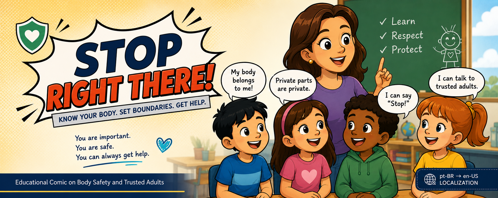

# Child Safety Educational Comic — Localization Project

  

  
  
  
  

---

## 🎯 Overview

This project involved the localization of a Brazilian Portuguese educational comic (K-9 level) focused on child safety, body autonomy, and trusted-adult communication.

The material was originally developed through a public initiative by the Court of Justice of Goiás (Brazil) and needed to be adapted for English-speaking elementary-age readers while keeping the educational tone intact and emotionally safe.

---

## 🧠 Context Analysis

Before starting the localization work, I reviewed the full material to understand how tone, vocabulary, and pedagogy were working together in the source text.

The focus was not just linguistic, but also how children are expected to interpret and emotionally respond to the content.

Key considerations included child-friendly language, repetition as a learning tool, and how authority is expressed through the teacher’s voice in sensitive topics.

📄 Full Context Notes: [Context_Notes.docx](Context_Notes.docx)

---

## 🌍 Localization Decisions

### 🧒 Child Language Preservation

**Source (pt-BR)**  
“Pipi / Pepequinha”

**Localized (en-US)**  
“Pee-pee / Wee-wee”

The original text validates child-generated vocabulary for private body parts. Instead of replacing it with anatomical terminology, I kept familiar equivalents used in U.S. early education contexts to preserve that same sense of accessibility.

---

### 🛡️ Safety Phrase Adaptation

**Source (pt-BR)**  
“Chega pra lá!”

**Localized (en-US)**  
“Stop right there!”

The phrase works as a recurring empowerment tool in the comic. The English version prioritizes immediacy and memorability, especially for children who may need to use it in real situations.

---

### 🌎 Cultural Adaptation of Support Systems

**Source (pt-BR)**  
doctor, nurse, and “conselheiro tutelar”

**Localized (en-US)**  
doctor, nurse, or trusted adult

Instead of translating institutional roles directly, I shifted the framing to “trusted adult,” which is a more familiar concept in U.S. child protection education and keeps the message understandable without requiring cultural explanation.

---

### 🎭 Name Adaptation for Readability

Some character names were adapted to preserve sound, meaning, and tone for English-speaking children.

Example:  
Aroldo Peraê → Arnie Hold On!

The goal was to maintain playfulness while ensuring natural pronunciation and readability.

---

## ⚡ Challenges Solved

Working with child safety content required careful attention to tone, since small wording choices could easily shift how the message is perceived.

- Adapting sensitive topics without losing clarity or emotional safety  
- Making culturally specific references understandable for a U.S. audience  
- Keeping consistency across multiple character voices in dialogue scenes  

---

## 🧰 Tools & Workflow

The workflow combined CAT tool work with manual review, especially in cases where context from the PDF alone wasn’t enough to guide decisions.

- MemoQ for segmentation, translation, and revision  
- Manual QA focused on tone and terminology consistency  

---

## 🧠 Skills Demonstrated

This project required balancing translation accuracy with editorial judgment, especially in content designed for young children and sensitive educational topics.

- pt-BR → en-US localization for child-focused educational content  
- Linguistic QA with attention to clarity and tone consistency  
- Cultural adaptation of safety-related educational messaging  
- Reading-level adjustment for elementary-age audiences  

---

## 🚀 Key Takeaways

This project goes beyond translation and focuses on how meaning is preserved across cultures when working with sensitive educational material.

It demonstrates decision-making around tone, readability, and cultural framing—especially in contexts where emotional safety and clarity are equally important.

---

## 🔒 Portfolio Note

Selected excerpts are included to respect confidentiality while still showing localization decisions, context analysis, and editorial reasoning.
